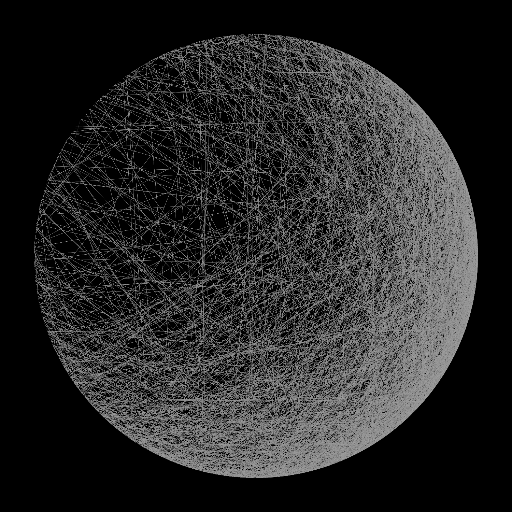

# Generative art in pure Javascript

## Installation

Run `npm install`, and then `npm start`. The former will download the necessary packages into the `web_modules` folder, and the latter will just serve the local files to `localhost:5000`.

## Result

The sketch will produce the following image:

